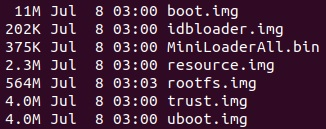

NanoPi4-ubuntu-docker
=====================

Build minimal image(<600M) for NanoPi-M4 / T4 / NEO4
OS Image for development with the following tidbits:

* MiniLoaderAll.bin
* idbloader.img
* resource.img
* uboot.img
* trust.img
* boot.img
* rootfs.img

# Build

To build and use the docker stuff, do the following:

* update.sh

        download or update dependencies, and make packages for docker.

* build.sh

        using aarch65 gcc-9.3 to cross-compile u-boot, kernel, rockchip stuff, libraries.
        option:
            Application=1       --- build app
            UnitTest=1          --- build test

* run.sh

        running the prepared environment for making images.

* make.sh

        make images.
        usage:
            make.sh [target]"
                make.sh loader    --- pack loader images
                make.sh boot      --- pack boot.img
                make.sh rootfs    --- pack rootfs.img
                make.sh all       --- pack all above
                make.sh devkit    --- use /opt/devkit for cross-compile or debugging

* clean.sh

        clean files by make.sh.
        usage:
            clean.sh [target]
	        clean.sh distro
	        clean.sh devkit
	        clean.sh docker
	        clean.sh packages
	        clean.sh all

* fusing.sh

        fusing images to emmc.
        usage:
            fusing.sh [target]
	        fusing.sh loader
	        fusing.sh resource
	        fusing.sh boot
	        fusing.sh rootfs
	        fusing.sh all

# Loader

* MiniLoaderAll.bin
r
        boot_merger RK3399MINIALL.ini

* idbloader.img

        mkimage -T rksd -n rk3399 -d rk3399_ddr_800MHz.bin idbloader.img
        cat rk3399_miniloader.bin >> idbloader.img

* resource.img

        resource_tool --pack --verbose --image=resource.img logo.bmp logo_kernel.bmp rk3399-nanopi4.dtb

* uboot.img

        loaderimage --pack --uboot u-boot.bin uboot.img 0x00200000

* trust.img

        trust_merger RKTRUST/RK3399TRUST.ini

# OS

* kernel

using m4 by default, select t4/neo4 by modify the **default = "conf_m4"@scripts/boot/fitImage.its**.

        description = "U-Boot fitImage for rk3399_aarch64 kernel";
        #address-cells = <1>;

        images {
                kernel { ... };

                fdt_t4 { ... };

                fdt_m4 { ... };

                fdt_neo4 { ... };

                initramfs { ... };
        };

        configurations {
                default = "conf_m4";

                conf_t4 { ... };

                conf_m4 { ... };

                conf_neo4 { ... };
        };

* busybox

        find . | cpio -oH newc | gzip > ramdisk.cpio.gz

* ubuntu

        ubuntu-base-20.04-base-arm64

# Rootfs

### runtime

- eudev
- libdrm
- libmali
- librga
- alsa
- mpp
- libusb
- zlib
- libjpeg
- libpng
- ffmpeg
- librealsense
- sdl2
- gdbserver
- gl4es

### application

- mpv
- sdlpal
- glmark2

### unit-test

- rga_test
- sdl_test
- opencl_test
- realsense_test
